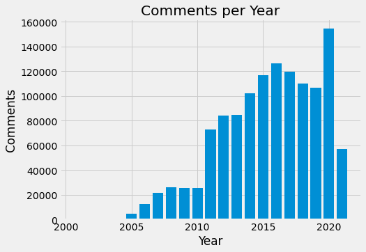

## Marginal.py

### Introduction

The Marginal Revolution blog has been around for decades and has accumulated tens of thousands of entries. This has generated a lot of data
which has served as a source for this project. The main investigative component of this project is analysing the interaction between the 
tags that accompany uploaded content and the comments generated by the audience. The tags indicate what taste for content
the uploaders have in what they create. On the other hand the comments are a proxy for how much audiences engage with and respond positively
to said content. At the outset an important caveat is this assumption is potentially flawaed. For example if the audience reacts negatively
to uploaded content they might choose to generate a lot of negative comments instead of ignoring it. It is also possible that an audience
can react positively to uploaded content and neglect to commemorate that in comments. Detailed site traffic is only held by the creators or
available from expensive online services like Alexa. As content creators the uploaders have competing incentives to please their audience
while writing about topics they enjoy writing about.

By scraping the site archives it is possible to accumulate the sum of comments generated in the blog posts and assign them to their tags. 
If certain tags are frequently included but have few accumulated comments then that is indicative of passion projects by the creators. In
other words it is enjoyable for the creators to write about but generates little profit. The converse of this is a situation where the 
audience is hungry for more content of this tag but the creators have little appetite to satisfy this demand.

### Implementation

With the outline of the project established the tasks can be clearly described and separated into scraping and analysis. Currently it is
difficult to run Python modules like matplotlib, numpy and pandas on Apple silicon. For that reason the scraping is done in a separate
file on the preferred editor VS Code. The analysis has to be done on Spyder because that is the only accessible way to use the Python 
scientific libraries

### Summary Analysis

The first plot shows the uploaders have very consistent work ethic uploading thousands of times a year every year since the blog's inception.

While most blogs have floundered with the rise of social media this blog has seen consistent rises in audience engagement (judged through
comments left on blog posts) year on year. 

The last plot shows that comments left on blog posts have an unusual distribution that appears to fit a Pareto distribution. The most common
result is for a blog post to have 0 comments but there is a right tail that extends to a single upload having close to 1,000 comments.
As a result this might generate a lot of variance in how much tags hew to their true level of audience engagement.

### Main Analysis

A csv file is created with ranked columns to visually display whether tags with high levels of posting frequency match up with tags that have
high levels of audience engagement. In a single year there might be some deviation but not enough for something near the bottom on one column 
to be near the top on another. That indicates that the content creators have an understanding of what the audience wants and mostly caters
to that. There is even less variation when the comparison is made across all years in a separate csv file.

The final graphic displays the same information contained in the aggregate csv file. The biggest discrepancy is that Books are blogged about
more than their ranked engagement from the audience judged by the comments they accumulate. Per year there is much more variance in where these tags are relative to their paired opposite column. This is consistent with the idea of the law of large numbers taking effect to level
out the highly variable nature of how many comments each blog post generates.

### Conclusion 

This project is designed to be extensible to other blog sites with similarly straightforward html structures.
